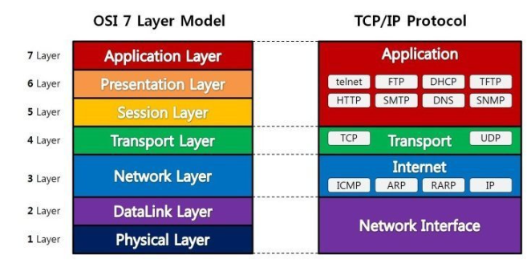

## OSI 7계층
- IOS 에서 개발한 모델로 컴퓨터 네트워크 프로토콜 디자인과 통신을 계층으로 나눈 개념
- TCP/IP는 OSI 모델을 기반으로 상업적이고 실무적으로 이용될 수 있도록 단순화된 것

### 작동 원리
1. OSI 7계층은 응용, 표현, 세션, 전송, 네트워크, 데이터링크, 물리 계층으로 나뉨
2. 전송시 7계층에서 1계층으로 각각의 층마다 인식 할 수 있는 헤더를 붙임(캡슐화)
3. 수신 시 1계층에서 7계층으로 헤더를 떼어냄(디캡슐화)
4. 출발지에서 데이터가 전송될 때 헤더가 추가되는데 2계층에서만 오류제어를 위해 뒷부분에 추가됨
5. 물리계층에서 1, 0의 신호가 되어 전송메체를 통해 전송

### 물리
- 7계층 중 최하위 계층
- 전기적, 기계적 특성을 이용해 데이터 전송
- 전달기능만 담당하여 알고리즘 오류제어가 없음
- 장비 : 케이블, 리피터, 허브
- 데이터 단위 : Bit

### 데이터 링크
- 포인트 투 포인트 간 데이터에 대해 비트단위로 신호화 및 동기화를 하여 신뢰성 있는 전송을 보장하기 위한 계층
- 오류나 재전송 기능이 존재함
- 프레임에 물리적 주소(MAC address)를 부여하고 에러검출, 재전송, 흐름제어를 수행
- 장비 : 브리지, 스위치
- 데이터 단위 : 프레임(Frame)

### 네트워크
- 데이터를 목적지까지 가장 안전하고 빠르게 전달
- Router를 통해 경로를 선택하고 주소를 정하고(IP) 경로에 따라 패킷을 전달 > IP 헤더가 붙음
- 장비 : 라우터, L3 스위치
- 데이터 단위 : Packet

### 전송
- Port 번호, 전송방식(TCP/IP)결정
  - TCP 헤더가 붙음
  - TCP : 신뢰성, 연결지향적
  - UDP : 비신뢰성, 비연결성, 실시간
- 두 지점간 신뢰성 있는 데이터를 주고받게 해주는 역할
- 신호를 분산하고 다시 합치는 과정을 통해 에러와 경롤르 제어
- 데이터 단위 : 세그먼트(Segment)

### 세션
- 두 지점간 프로세스 및 통신하는 호스트간 연결 유지
- TCP/IP 세션 체결, 포트번호 기반 통신 세션 구성

### 표현
- 데이터의 표현 방식을 결정
- 파일 인코딩, 명령어 포장, 압축, 암호화
- ASCII, GIF, JPEG 등

### 응용
- 최종 목적지로 응용 프로세스와 직접 관계하여 일반적인 응용 서비스를 수행
- Http, Ftp, Smtp 등의 프로토콜이 존재