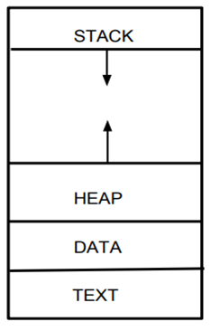
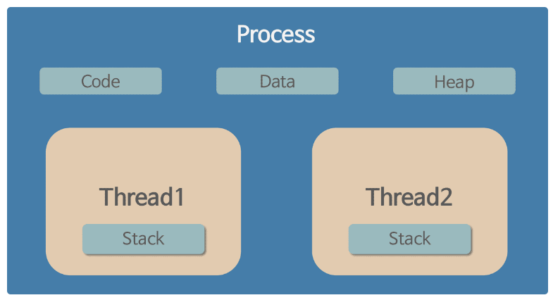

# 프로세스 & 스레드
- 운영체제에서 작업을 수행하는 단위들
## 프로세스
- 프로그램의 인스턴스
- 각 프로세스는 독립적 메모리 공간을 가짐
- 서로의 메모리에 접근이 불가하여 데이터 공유를 위해서 IPC 간 통신 기법이 필요
- 메모리 구조는 코드, 데이터, 힙, 스택 영역으로 구성되어, 생성과 문맥 전환에 비용이 큼

### 자원 구조
- 프로세스는 그림과 같은 메모리 영역으로 구성됨

- 코드 영역(Code/Text)
  - 개발자가 작성한 프로그램의 함수 코드가 CPU가 해석 가능한 기계어 형태로 저장
- 데이터 영역(Data)
  - 코드가 실행되며 사용하는 전역 변수나 각종 데이터들이 모여있음
  - data, rodata, bss 영역으로 세분화 됨
    - data : 전역 변수, static 변수 등 프로그램이 사용하는 데이터를 저장
    - bss : 초기값이 없는 전역 변수, static 변수가 저장
    - rodata : const 같은 상수 키워드 선언된 변수나 문자열 상수가 저장 
- 스택 영역(Stack)
  - 함수의 호출과 관계되는 지역변수와 매개변수가 저장됨 
  - 함수의 호출과 함께 할당되며 함수의 호출이 완료되면 소멸
- 힙 영역(Heap)
  - 생성자, 인스턴스와 같은 동적으로 할당되는 데이터들을 위해 존재하는 공간
  - 사용자에 의해 메모리 공간이 동적으로 할당되고 해제됨
- 코드와 데이터 영역은 선언시 크기가 결정되는 정적 영역임
- 스택과 힙은 프로세스가 실행되는 동안 크기가 변경되는 동적 영역이므로 그림처럼 화살표로 표시됨

### 프로세스간 자원 공유
- 각 프로세스는 메모리에 별도 주소공간에서 실행되어 기본적으론 다른 프로세스의 변수나 자료구조에 접근 불가
- 이를 해결하기 위해서 아래의 방법들이 존재함
  - IPC(Inter-Process-Communication)
  - LPC(Local inter-Process Communication)
  - 별도로 공유 메모리를 생성하여 정보를 주고받도록 설정

### 멀티 프로세스
- 여러 독립 프로세스를 생성하여 병렬 처리를 수행
- 각 프로세스는 자체 메모리를 독립적으로 실행하여 데이터 공유가 어려우며 공유를 위해서는 IPC 를 사용 해야함
- 하나의 프로세스에 문제가 생겨도 다른 프로세스에 영향을 미치지 않음

### PCB
- Process Control Block
- 운영체제에서 프로세스를 관리하기 위해 해당 프로세스의 상태 정보를 담고 있는 자료 구조를 의미
- 프로세스 스케줄링을 하기 위해 프로세스에 관한 모든 정보를 저장하는 임시 저장소
- 문맥 교환(ContextSwitch) 시 프로세스 상태를 저장하고, 다시 실행시 복구 할 수 있게 함

### 프로그램 VS 프로세스
- **프로그램 정의**
  - 컴퓨터에서 실행 할 수 있는 파일
  - 실행하기 전의 파일을 의미함

- 차이점
  - 프로그램
    - 어떤 작업을 하기 위해 실행 할 수 있는 파일
    - 파일이 저장장치에는 존재하나 메모리에 올라가있지 않은 정적인 상태
  - 프로세스
    - 실행되어 작업중인 프로그램
    - 메모리에 적재되고 CPU 자원을 할당받아 프로그램이 실행 되고 있는 상태

## 스레드
- 프로세스 내에서 실행되는 작업의 단위
- 한 개의 프로세스는 최소 1개 이상의 스레드를 가짐
- 한 개의 프로세스는 여러 스레드를 가질 수 있으며 이를 멀티 스레딩 이라고 부름
- 스레드는 프로세스 내 데이터, 힙 영역을 공유하나 각 스레드별 스택과 레지스터를 갖고있음
- 생성과 문맥 전환은 비교적 비용이 적음

- 프로세스의 4가지 메모리 영역중 스레드는 스택 만 할당 받아 복사하고 다른 영역은 프로세스 내 스레드간 공유됨

### 스레드의 자원 공유
- 스레드가 여러개 있으면 한 프로세스에서 다른 작업을 동시에 할 수 있음
- 스레드간 프로세스 자원을 공유하며 프로세스 실행 흐름의 일부가 되어 동시 작업이 가능
- 아래 그림처럼 한 프로세스 내 여러개의 스레드가 존재하는 상태가 됨

#### 스레드가 독립적인 스택을 갖는 이유
- 멀티 스레드 환경에서 충돌 방지
- 지역변수의 독립성
- 독립적인 스택을 가져 문맥 전환이 빠르게 이루어 질 수 있음
  - 독립적이지 않다면 데이터 충돌 및 무결성에서 문제가 발생할 가능성이 높음

#### 스레드가 많을 수록 무조건 좋은가?
- 아님
- 문맥 전환에도 일정한 비용이 발생하고 스레드의 상태를 저장하고 복구하는 과정에서 자원이 소비되어 전체 성능저하의 가능성이 존재
- 여러 스레드가 동시에 같은 자원에 접근하면 경쟁 상태 등의 문제가 발생 할 수 있음
- 독립적은 스택 사용으로 메모리 부족 문제가 발생 가능

### 멀티 스레드
- 한 프로세스가 여러 스레드를 생성하여 병렬처리를 수행
- 스레드는 동일 메모리 공간을 공유