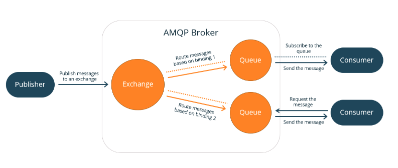

## AMQP
- Advanced Message Queuing Protocol
- 메시지 지향 미들웨어를 위한 개방형 표준 응용계층 프로토콜
- 서로 다른 시스템들 간 메시지 교환을 위해 등장함
- 손실이나 중복 없이 메시지를 전달해야하는 경우 적합

### 특징
- 메시지 기반 Queuing
- 라우팅(P2P)
- 신뢰성
- 보안 및 트랜잭션 지원

### 구현체
- Rabbit MQ
- OpenAMQ
- StormMQ
- Apache Qpid

### 구조

- 큐 구조에 Exchange 의 라우터가 존재
- Publisher 에게 메시지를 수신하여 Queue 에 분배
- 저장된 메시지를 Consumer 가 소비
- 여러개의 Consumer 가 존재하는 경우 높은 효율

### Exchange Type
- Direct Exchange :
  - 메시지의 라우팅 키를 큐에 1:1로 매칭
- Fanout Exchange :
  - 모든 메시지를 모든 큐로 라우팅 하는 유형
  - Fanout Exchange 는 Exchange와 매칭된 모든 Queue에 메시지를 전달, 이 때 라우팅 키는 무시됨
  - 1:N으로 브로드캐스트 하는 용도
- Topic Exchange :
  - Direct Exchange 와 유사하나 고정된 라우팅 키를 사용하는 것 대신 와일드 카드를 사용
  - 메시지는 하나 or 여러개의 맞는 큐에 보내짐
  - 라우팅 키는 ,로 구분된 0 개 이상의 단어 집합으로 간주되어 와일드 카드 문자들을 이용해 바인딩
  - '*' - 하나의 단어
  - '#' - 0개 이상의 단어
- Headers Exchange :
  - 마지막으로 Headers Exchange 는 routing key 대신 헤더 속성을 통해 라우팅
  - Key-Value 로 정의된 헤더에 의해 라우팅 결정
  - 큐를 바인딩 할 때 x-match 라는 특별한 argument 로 헤더를 어떤식으로 해석하고 바인딩 할 지 결정
  - all : 모두 충족(and)
  - any : 하나만 충족해도 됨(any)