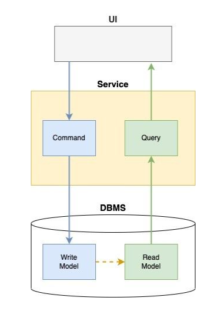
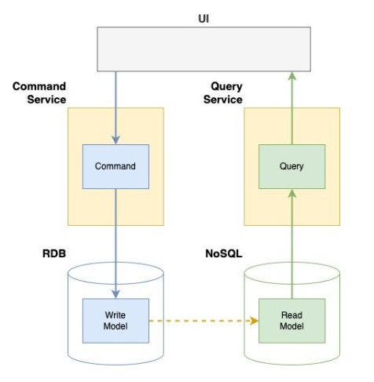

## CQRS
- 명령(Command)과 질의(Query)의 책임(Responsibility)의 분리(Segregation) 하는 패턴
- 쓰기를 위한 데이터 모델과 읽기를 위한 데이터 모델을 분리하는 패턴

### 사용하는 이유
- 읽기전용 DB와 쓰기 전용 DB를 분리 가능
- 더 빈번한 서비스를 독립적으로 확장 가능
- 각 로직을 분리하여 각각 독립적으로 유지보수 가능

### 언제 사용하는가
- 대규모 애플리케이션으로 명령과 조회 로직이 복잡하고 데이터에 대한 작업이 많은 경우
- 조회 요청이 잦으며 복잡한 조회 요구사항이 존재하는 경우

### 아키텍쳐
- 단일 DB 에서 구현 방법

- 쓰기, 읽기 전용 DB로 분리했을 때
  
  - 확장성 문제는 해결되나 동기화 처리의 신뢰성이 보장되어야 함