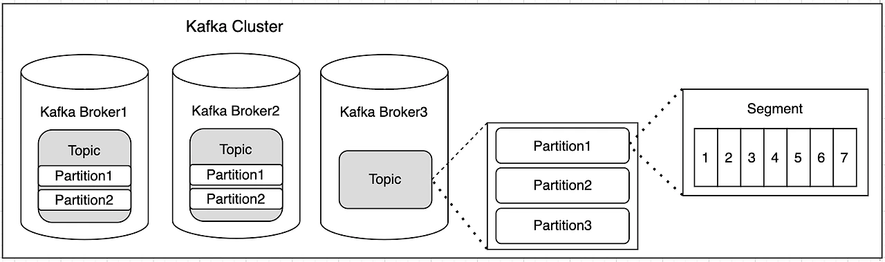

## Apache Kafka
- Scalar 언어로 개발된 오픈소스 메시지 브로커 프로젝트
- 실시간 데이터 피드를 관리하기 위한 높은 처리량, 낮은 지연시간을 지닌 플랫폼 제공

### 특징
- Producer/Consumer 분리 구조
- 메시지를 여러 Consumer에게 허용
- 높은 처리량을 위한 메시지 최적화
- 관련 생태계 제공

### 구조

- 카프카는 클러스터 -> 토픽 -> 파티션 -> 세그먼트로 구성됨

#### Cluster
- 여러개의 서버(Broker)로 구성된 Kafka 시스템
- 대량의 데이터를 처리하고 여러 소비자와 생산자에게 메시지 서비스를 제공
- 메시지의 저장, 처리, 전달을 담당
- 고가용성과 확장성을 제공하며 데이터를 여러 브로커에 분산시켜 저장

#### Broker
- Kafka 시스템을 구성하는 개별 서버
- Kafka 클러스터를 형성하여 전체 시스템의 일부로 작동
- 각 브로커는 토픽의 하나 이상의 파티션을 저장하고 관리하여 파티션에는 메시지나 레코드가 순차적으로 저장
- 생산자(Producer)로 부터 데이터를 받아 저장하고 소비자(Consumer)의 요청에 따라 데이터를 제공
- 데이터의 안정성을 위해 파티션을 여러 브로커에 복제하여 장애가 발생해도 시스템은 작동
- 각 파티션별로 '리더'와 '팔로워' 브로커가 존재하여 데이터 일관성과 부하를 분산함
  - 리더 : 모든 읽기 및 쓰기 작업 처리
  - 팔로워 ; 리더의 데이터를 복제
- 브로커들은 클러스터 내에서 통신하여 데이터 동기화와 상태 정보를 공유

#### Topic
- 메시지들의 특정 카테고리나 피드를 나타냄
- 생산자가 데이터를 보내는 대상 및 소비자가 데이터를 읽는 출처
- 데이터를 카테고리화 하여 관리
- 한 토픽은 여러 소비자가 구독 가능

#### Partition
- Kafka 토픽을 구성하는 하위 단위
- 하나의 토픽은 여러개의 파티션으로 나뉘어 질 수 있음
- 각 파티션은 독립적으로 데이터를 저장하여 여러 브로커에 분산 가능
- 각 파티션에서 메시지는 순차적으로 저장되며 이 순서는 파티션 내에서 유지됨
- 파티션을 추가하여 시스템의 부하를 낮출 수 있음

#### 세그먼트
- 파티션의 데이터를 실제로 저장하는 물리적인 파일
- 파티션 내의 데이터를 저장하는 기본 단위
- 각 세그먼트 파일은 일정 크기에 도달하거나 일정 시간이 경과하면 새로운 파일로 전환
- 설정에 따라 오래된 세그먼트를 삭제하거나 중복 제거하는 방식으로 데이터를 관리