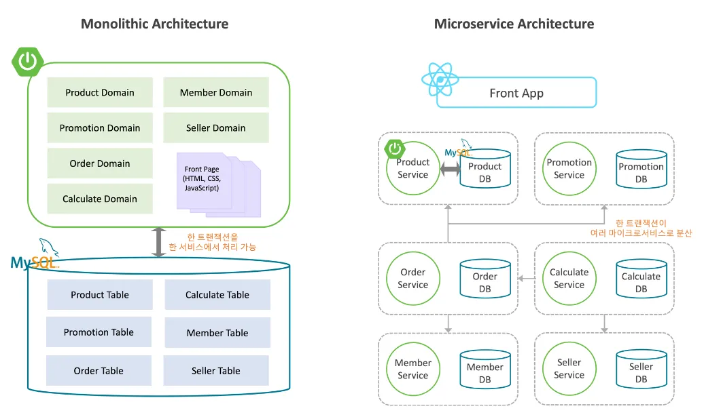

## MSA(Micro Service Architecture)
- 서버를 각각 독립적인 여러개의 작은 서비스로 나누어 구축하는 형태
- 각 서비스는 독립적으로 운영, 배포, 확장이 가능
- 팀별로 독립적 개발이 가능함

### 탄생 배경
- 기존에는 하나의 애플리케이션으로 개발하는 모놀리식 아키텍쳐가 일반적
- 서비스가 커질수록 유지보수와 확장이 어려워지는 단점이 발생
- 대규모 프로젝트일수록 시스템을 다시 빌드하고 배포해야 하나, 시간이 오래 걸림
- 이를 해결하기 위해 각 기능을 독립적인 서비스로 분리하여 빠른 개발과 배포를 할 수 있게 됨

## Architecture
