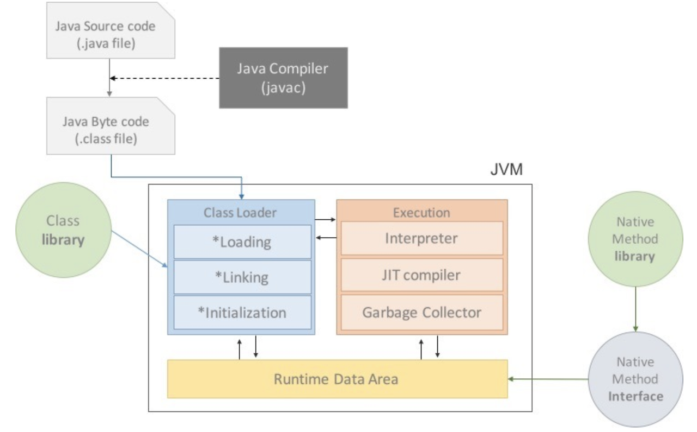

## JVM
- Java Virtual Machine(자바 가상 머신)
- 자바 어플리케이션을 클래스 로더를 통해 읽어들여 자바 API와 함께 실행하는것
- Java와 OS 사이 중개자 역할을 수행하여 OS 독립 작동을 가능케함
- Garbage Collection(가비지 컬렉션)을 수행

### 특징
- 컴파일된 바이트 코드를 기계가 이해 할 수 있는 기계어로 변환
- 스택 기반의 가상 머신
- 메모리 관리, GC 수행

### 구조

- 크게 Class Loader, Runtime Data Areas, Execution Engine, GC 로 나눌 수 있음

#### Class Loader(클래스 로더)
- 어플리케이션 실행 시점에 필요한 클래스 파일을 메모리에 로드
- JVM이 해당 클래스를 실행 할 수 있도록 준비하는 역할
- Loading : 클래스 파일을 찾아 JVM 메모리 영역의 메소드 영역에 적재
- Linking : 정적 변수의 값을 설정, 클래스 초기화 블록 실행
- Initialization : 정적 변수의 값을 설정하고, 클래스의 초기화 블록 실행

#### Execution Engine(실행 엔진)
- 메모리에 로드된 바이트 코드(.class)를 실제 기계어로 변환하여 실행하는 역할을 함
- 인터프리터와 Jit 컴파일러를 결합하여 프로그램의 실행속도를 높임
- 처음엔 인터프리터로 실행하다 반복적인 부분이 발견되면 JIT 컴파일러로 실행됨
- Interpreter
  - 바이트 코드를 한 줄씩 기계어로 해석하고 실행
  - 빠르게 실행 할 수 있으나 반복적인 코드에 대해선 비효율적
- JIT(Just-In-Time) Compiler
  - 실행 시점에 바이트 코드를 기계어로 변환하여 최적화된 네이티브 코드로 실행
  - 특정 코드가 반복적으로 실행 될 때 네이티브 코드로 컴파일하여 캐시
- Garbage Collector
  - 메모리 관리의 일부로, 더 이상 참조되지 않는 객체를 찾아 자동으로 메모리를 해제

#### Runtime Data Areas(런타임 데이터 영역)
- 실행되는 동안 메모리를 다양한 영역으로 나누어 관리함
- Method Area(메소드 영역)
  - 모든 스레드가 공유하는 메모리 영역
  - 클래스 로더에 의해 로드된 클래스 메타 데이터를 저장
- Heap(힙)
  - 객체와 배열 데이터가 저장되는 메모리 영역으로 모든 스레드가 공유
  - 가비지 컬렉션의 대상이 되는 주요 영역
    - Young Generation, Old Generation 으로 나뉘어 가비지 컬렉션의 효율성을 높임
- JVM Stack(스택)
  - 각 스레드마다 할당되는 메모리 영역으로 메소드 호출시 생성되는 프레임을 저장
  - 지역 변수, 메소드 호출 정보, 스레드별 실행되는 메소드의 매개변수, 임시 데이터등을 저장
- Native Stack(네이티브 스택)
  - Java 이외의 언어에 제공되는 Method 의 정보가 저장되는 공간
  - JNI(Java Native Interface)를 통해 실행되는 네이티브 코드를 관리
- PC Register(PC 레지스터)
  - 각 스레드마다 하나씩 존재하며, 현재 실행중인 명령어의 주소를 저장하는 공간
  - JVM 은 멀티 스레드를 지원하므로, 각 스레드마다 PC 레지스터를 통해 명령어의 실행 위치를 추적함

#### Garbage Collection(가비지 컬렉션)
- JVM 이 자동으로 메모리를 관리하는 메커니즘
- 더 이상 사용되지 않는 객체를 찾아 제거하여 메모리 누수를 방지