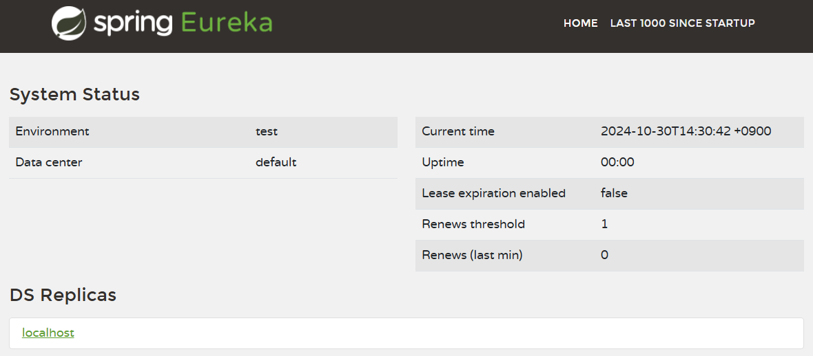
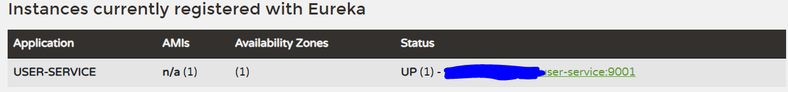

## Eureka
- Netflix 에서 개발한 Service Discovery 서버

### Service Discovery
- MSA 에서 서비스가 서로를 찾고 통신할 수 있도록 도움을 주는 기능
- 분산 시스템에선 서비스 인스턴스가 동적으로 추가되거나 제거되기 때문에 각 서비스간 위치 정보를 동적으로 등록하고 사용 가능

### Service Registration
- 각 MS는 Eureka Server 에 자신의 IP 주소와 포트 번호를 등록함
- Eureka Server는 현재 사용 가능한 모든 서비스 인스턴스 목록을 알고있음

## 시작하기
1. Spring 프로젝트 생성
2. Spring Cloud Discovery -> Eureka Server 체크
3. 어플리케이션에 EnableEurekaServer 어노테이션 추가
```java
@SpringBootApplication
@EnableEurekaServer
public class EcommerceApplication {

    public static void main(String[] args) {
        SpringApplication.run(EcommerceApplication.class, args);
    }
}
```
4. yaml 파일 수정
```yaml
server:
  port: 8761

spring:
  application:
    name: discoveryService

eureka:
  client:
    register-with-eureka: false
    fetch-registry: false
```
- eruka.client
  - 서버가 시작 될 때 서버의 정보를 eureka 서버에 등록하는 설정
  - register-with-eureka : eureka 서버에 자신을 등록
  - fetch-registry : 다른 서버의 목록을 받음
  - 이 서버가 eureka 서버이기 때문에 등록을 할 필요가 없음
5. 서버에 접속하면 아래와 같은 대시보드가 보임[localhost:8761](http://localhost:8761/)


### Eureka 에 서버 추가하기(Client 추가)
1. 프로젝트 생성 시 Eureka Discovery Client 의존성 추가
2. 애플리케이션에 EnableDiscoveryClient 어노테이션 추가
```java
@SpringBootApplication
@EnableDiscoveryClient
public class UserServiceApplication {

    public static void main(String[] args) {
        SpringApplication.run(UserServiceApplication.class, args);
    }
}
```
3. yml 수정
```yml
server:
  port: 9001

spring:
  application:
    name: user-service

eureka:
  instance:
  instance-id: ${spring.cloud.client.hostname}:${spring.application.instance_id:${random.value}}
  client:
    register-with-eureka: true
    fetch-registry: true
    service-url:
      defaultZone : http://localhost:8761/eureka
```
- port : port 번호를 0으로 주어 남는 포트에 동적으로 할당될 수 있도록 설정
- instance-id : 동일한 이름으로 eureka 에 등록되더라도 구별할 수 있도록 instance-id를 부여
- register-with-eureka : eureka 서버로부터 인스턴스의 정보를 주기적으로 가져올것인지 설정하는 옵션. true 인 경우 갱신된 정보를 받음
- service-url.defaultZone : eureka 서버의 주소를 입력

#### 등록된 화면

- Application : 등록된 서버 이름
- Availability Zones : 등록된 서버 수
- Status : 서버의 상태
  - 서버가 살아있으면 Up, 죽은경우 Down