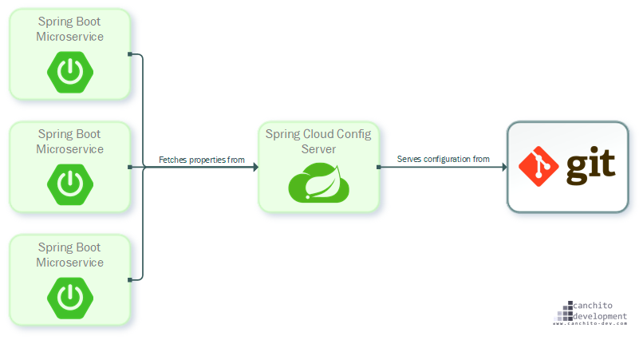

## Spring Cloud Config
- 분산 시스템에서 서버, 클라이언트 구성에 필요한 설정정보(application.yml)를 외부 시스템에서 관리
- 하나의 중앙화된 저장소에서 구성요소 관리 가능
- 각 서비스를 다시 빌드하지 않고 바로 적용 가능
- 애플리케이션 배포 파이프라인을 통해 DEV-UAT-PROD 환경에 맞는 구성 정보 사용
- Config Server 와 Config Client로 구성됨
- 


### 특징
- 중앙 집중식 관리 : 여러 어플리케이션의 설정을 한곳에서 관리하여 구성 변경시 일관성 유지
- 외부 저장소 지원 : Git, SVN, 파일 시스템 등 다양한 백엔드를 지원하여 구성 가능
- 프로필 기반 구성 : 개발, 테스트, 운영 등 환경별 구성을 분리하여 적용 가능

### 설정파일의 우선순위
- 설정파일은 아래와 같은 순서로 로드되어 나중에 로드될수록 우선순위가 높아 동일한 환경변수일 경우 우선순위가 높은쪽으로 덮어 씌워짐
- 프로젝트의 application.yaml
- 설정 저장소의 application.yaml
- 프로젝트의 application-{profile}.yaml
- 설정 저장소의 {application name}/{application name}-{profile}

## Config Server 구성 방법
1. 설정을 저장할 git 생성(로컬도 무관함)
2. {설정 이름}.yml 파일 git에 추가
3. 빈 프로젝트 생성
4. Spring Cloud Config Server 의존성 추가
5. EnableConfigServer 어노테이션 추가
6. 서버 포트 8888지정(권장)
7. uri 정보 입력
- git을 Public 로 업로드한 경우 별도의 처리 없이 주소만 입력해도 됨
```yaml
server:
  port: 8888

spring:
  application:
    name: config-server
  cloud:
    config:
      server:
        git:
          uri: https://github.com/GalmaekiMSAPractice/ConfigStore
```
8. 서버 실행 후 localhost:8888/{설정 이름}/default 에서 설정 확인