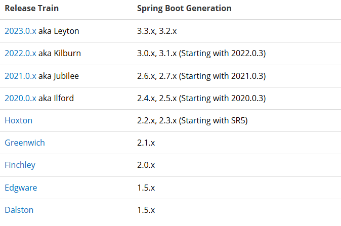
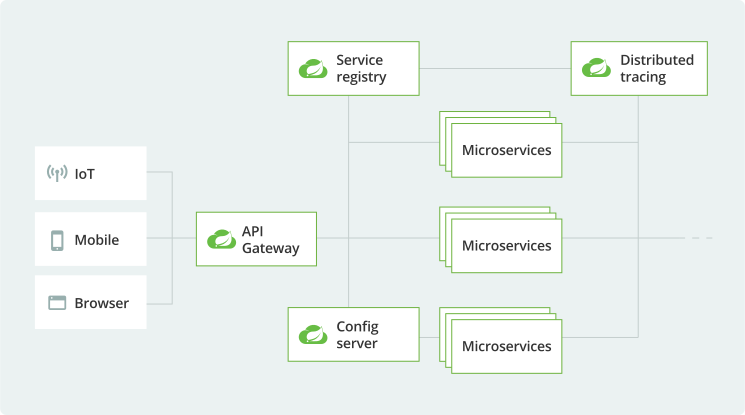

## Spring Cloud
- 스프링 부트 기반 클라우드 네이티브 애플리케이션을 개발하기 위한 프로젝트
- Spring 환경에서 MSA 구현시 사용 할 수 있음
- [공식문서](https://spring.io/projects/spring-cloud)

#### 버전 주의사항
- Spring Cloud 사용시 Spring Boot 를 사용해야함
- 

### 아키텍쳐
- 

### Spring Cloud Components
#### Spring Cloud Config Server
- 분산된 환경의 서버에서 환경설정 정보를 모아 중앙에서 관리할 수 있음
- 중앙 집중식 설정 관리
- 설정파일을 Git 이나 다른 외부 저장소에 보관함
- 설정변경 필요시 애플리케이션 코드를 수정하지 않고 업데이트 가능
- 재배포나 재시작 없이 설정을 실시간 반영 가능
- 유지보수가 쉬워짐

#### Eureka
- 클라우드 환경 다수의 서비스 들의 로드 밸런싱 및 장애 조치 목적을 가진 미들웨어 서버
- MSA 환경에서 각각의 서비스가 자신의 위치를 등록하고 다른 서비스가 이를 조회 할 수 있도록 할 수 있음
- 특정 서비스가 재배포되어 IP가 바뀌어도 클라이언트는 새로운 위치정보를 Eureka 에서 받아와 연결 할 수 있음

#### Spring Cloud Gateway
- API Gateway
- 모든 외부요청이 이를 통해 내부의 마이크로 서비스로 분산됨
- 라우팅과 필터링을 제공하며 요청의 흐름을 관리
- 단일 진입점을 제공하여 요청을 효율적으로 관리하고 보안을 강화 할 수 있음
- 로드밸런싱을 지원하여 트래픽을 균등하게 분산할 수 있음

#### Ribbon
- Client 측 Load Balancer
- Eureka 와 연결되어 동적으로 설정 가능
- Gateway 를 통과한 요청이 Ribbon 을 통해 각 마이크로 서비스로 분산 됨

#### Feign Client
- 각각의 서버간 통신을 위해서 사용하는 라이브러리
- Netflix 에서 개발한 Http Client
- 기존의 HttpClient 와 비교할 때 사용하기 편리함

#### Hystrix
- 외부 시스템으로 인한 서비스의 지연과 장애에 대한 내성을 갖게 해주는 라이브러리
- Circuit Breaker
  - 네트워크 호출에서 장애가 발생했을 때 더이상 요청을 보내지 않도록 회로를 차단함
- Fail Fast
  - 장애가 발생할것으로 예상되는 경우 빠르게 실패처리하여 비효율적인 대기시간을 줄여 시스템 자원을 보호
- Fallback
  - 요청 실패시 기본 응답이나 대체 로직을 수행할 수 있는 폴백 기능을 제공

#### Spring Cloud MSA 간 통신
- 기존 Spring Cloud 에서 MSA간 통신 방법으론 아래 두가지가 존재
1. RestTemplate
```java
RestTemplate restTemplate = new RestTemplate();
restTemplate.getForObject("http://localhost:8080/",User.class,200);
```
2. Feign Client
```java
@FeignClient("stores")
public interface StoreClient {
    @RequestMapping(method = RequestMethod.GET, value = "/stores")
    List<Store> getStores();
}
```