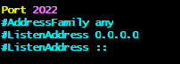

## 공기계에서 스프링 실행하기


- 모바일 환경에서 리눅스 환경을 이용할 수 있게 해주는 어플리케이션 설치


- 초기의 리눅스 환경이기 때문에 업데이트
```shell
sudo apt update
```

- SCP를 이용하여 파일을 전송할 예정이므로 ssh 를 설치해야함
  - secure copy의 약자로 ssh를 이용하여 네트워크로 연결된 호스트간 파일전송용 명령어
```shell
sudo apt install openssh-server
```

- OpenSSH 의 설정을 편리하게 변경하기 위한 텍스트 편집기(VIM)를 설치
```shell
sudo apt install vim
```



- OpenSSH 의 설정을 변경
  - Vim에서 편집모드는 'i' 를 눌러 진입 가능
- Port 22 와 ListenAddress 0.0.0.0 , PasswordAuthentication 부분을 주석 해제
  - Port 22 
    - ssh를 연결할 포트를 설정함
    - 루팅되지 않은 공기계는 0 ~ 1023 포트를 사용 할 수 없어 2022 포트를 사용함
  - PasswordAuthentication
    - ssh 연결 시 패스워드 인증

```shell
sudo service ssh start
```
- ssh 서버를 시작

- ssh를 열어도 wifi 공유기에서 포트포워딩 설정을 하지 않아 연결이 제대로 들어오지 않음
- 이를 위한 포트포워딩 설정을 해야함

- 네트워크 정보를 확인하기 위해 net-tools 설치
```shell
sudo apt install net-tools
```

- 네트워크 정보를 확인하기 위한 명령어 ifconfig 실행과 공인 IP 확인을 위한 curl ifconfig.me 실행
```shell
ifconfig
```
```shell
curl ifconfig.me
```


- 주의 - ipconfig 가 아닌 ifconfig 임
  - IP Address 설정이 아닌 Interface 설정이기 때문  

- 공유기 설정에 접속하여 포트포워딩 메뉴 진입


- 외부 포트와 내부 포트는 위에서 설정한 2022 포트로 지정
- ifconfig 이미지에서 확인한 inet(로컬 ip) 주소를 내부 ip 주소에 입력

- 데스크탑 터미널에서 ssh 연결
```shell
ssh -p {위에서 지정한 포트} userland@{ifconfig 이미지의 회색 공인 ip}
```

- spring 실행을 위해 버전에 맞는 java 설치
```shell
sudo apt install openjdk-17-jdk
```
- 자바 설치 확인을 위한 버전확인 명령어
```shell
java -version
```


- 미리 준비해둔 서버의 jar 파일을 SCP를 통해 전송하려했으나 connection closed 오류 발생


- -O 옵션을 주어 해결
  - 구버전의 scp 프로토콜을 사용하도록 강제하는 명령어
  - OpenSSH 는 기본적으로 SFTP 을 사용하려하나 Userland 앱의 문제인지 SFTP가 작동되지 않음


<br>


- 서버 실행

- 모바일에서 localhost:8080으로 접속하여 서버가 정상적으로 실행중인지 확인 가능


- 외부에서 접속하기 위해선 공유기의 포트포워딩을 한번 더 해줘야함


